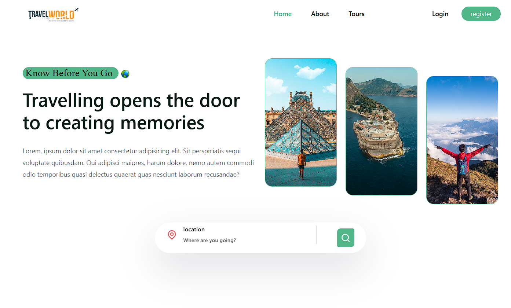

<div align="center">
  <br />
      
  <br />

  <div>
    
    
    
    
    
  </div>

  <h3 align="center">🏝️ Tours Booking Website  </h3>

   <div align="center">
     Build this project step by step by Motaz_Y
    </div>
</div>

## 📋 <a name="table">Table of Contents</a>

1. 🤖 [Introduction](#introduction)
2. ⚙️ [Tech Stack](#tech-stack)
3. 🔋 [Features](#features)
4. 🤸 [Quick Start](#quick-start)
5. 🔗 [Links](#links)
6. 🚀 [More](#more)

## <a name="introduction">🤖 Introduction</a>

A full-stack **MERN** (MongoDB, Express, React + Vite, Node.js) web application for discovering tours, booking trips, managing profiles, and leaving reviews.  
The project is built with **React (Vite)** on the frontend, **Node.js + Express** on the backend, and **MongoDB** as the database.

## <a name="tech-stack">⚙️ Tech Stack</a>

- React.js
- MongoDB
- ReactStrap
- Node.js
- Express.js
- CSS

## <a name="features">🔋 Features</a>

👉 **Authentication System**: A robust authentication system ensuring security and user privacy

👉 **Explore Page**: Homepage for users to explore tours, with a featured section for top reviews

👉 **Booking Functionality**: Enable users to book tours, with dedicated pages for managing bookings

👉 **Detailed Tour Page**: A detailed tour page displaying content

👉 **Profile Page**: A user profile page showcasing user information and bookings, providing options to edit the profile

👉 **Edit Tour booking Functionality**: Provide users with the ability to edit the tour booking

👉 **Responsive UI with Bottom Bar**: A responsive UI with a bottom bar, enhancing the mobile app feel for seamless navigation

👉 **Backend as a Service - MongoDB Atlas**: Utilize MongoDB Atlas as a Backend as a Service solution for streamlined backend development, offering features like authentication, database, file storage, and more

and many more, including code architecture and reusability

## <a name="quick-start">🤸 Quick Start</a>

Follow these steps to set up the project locally on your machine.

**Prerequisites**

Make sure you have the following installed on your machine:

- [Git](https://git-scm.com/)
- [Node.js](https://nodejs.org/en)
- [npm](https://www.npmjs.com/) (Node Package Manager)

**Cloning the Repository**

```bash
git clone https://github.com/MoTaz-Y/TravelWorld.git
cd TravelWorld
```

**Installation**

Install the project dependencies using npm:

```bash
npm install
```

**Set Up Environment Variables**

Create a new file named `.env` in the root of your project and add the following content:

```env
PORT =
MONGO_URI =
JWT_SECRET =
JWT_EXPIRE =
JWT_COOKIE_EXPIRE =
NODE_ENV =
```

Replace the placeholder values with your actual credentials.

**Running the Project**

```bash
npm start
```

## <a name="links">🔗 Links</a>

Assets used in the project are [here](https://drive.google.com/file/d/13_7FofRAC3wARqPtAVPi53QNJJRd5RH_/view?usp=sharing)

## 👨‍💻 About Me

<div align="center">


</div>

<p align="center">
  I'm <strong>MoTaz</strong>, a <strong>Full-Stack Developer</strong> passionate about building clean, user-friendly applications with modern technologies.
  <br/>
  I love working with <strong>MERN Stack</strong>, <strong>TypeScript</strong>, <strong>Tailwind CSS</strong>, and <strong>Appwrite</strong>. I'm also interested in DevOps and building scalable cloud-native apps.
</p>

<div align="center">
  
</div>

### 💡 Capabilities

- ⚡ Building full-stack web apps with MERN & Appwrite
- 📱 Creating responsive, accessible UIs with Tailwind
- 🔐 Secure authentication systems
- ⚙️ API design, database modeling, and cloud deployment
- 🔄 Real-time data fetching with React Query
- 🧪 Writing clean, reusable, testable code

---

> "Code is like humor. When you have to explain it, it’s bad."

---

### 🎯 Contact Me

<div align="center">
  <a href="https://www.linkedin.com/in/motaz-yasser" target="_blank">
    
  </a>
  <a href="mailto:motazyasser84@gmail.com">
    
  </a>
  <a href="https://github.com/MoTaz-Y" target="_blank">
    
  </a>
</div>
